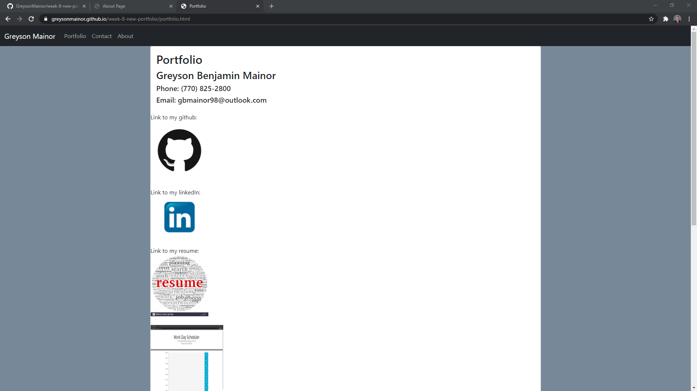
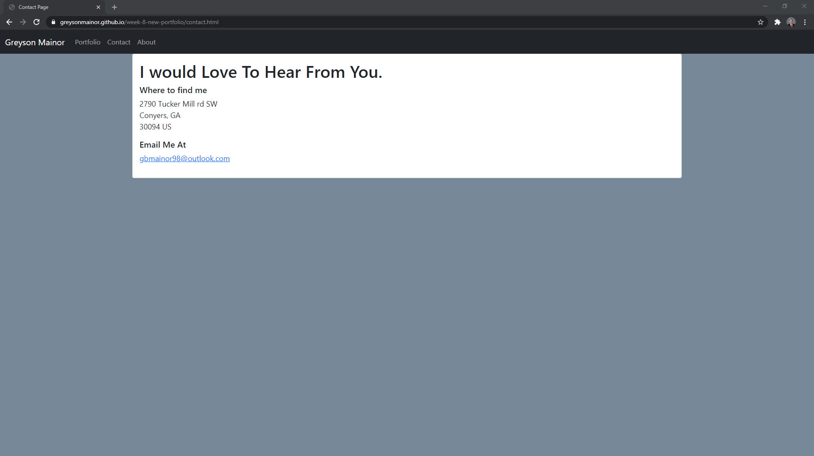
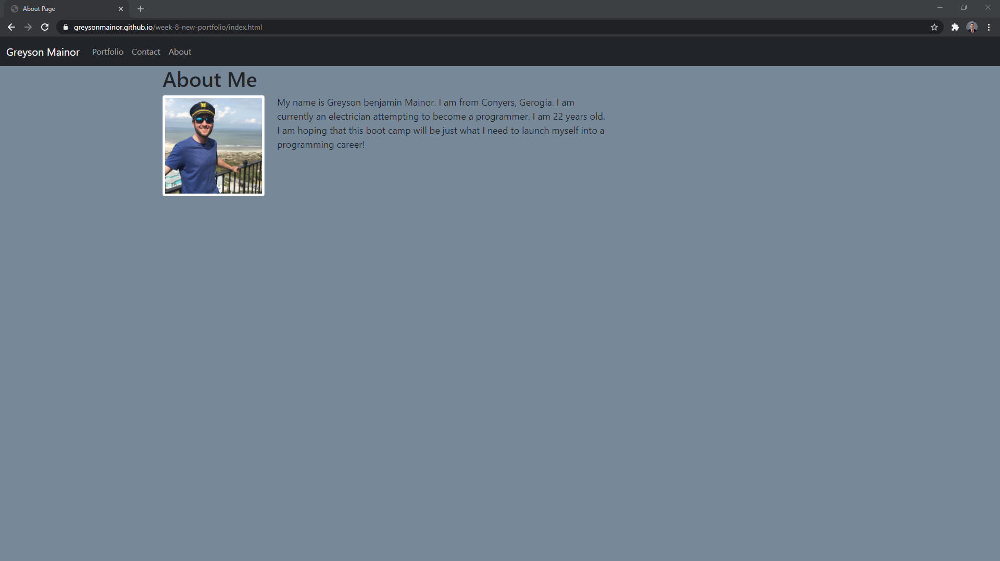

# Updated-portfolio





## Description
This application is an updated version of my portfolio.  It includes links to both projects as well as other notable works.  Along with this it also has been updated with my new resume, updated linkedin, and github.

 ## Table of contents

-[Installation](#installation)

-[Usage](#usage)

-[License](#license)

-[Contributing](#contributing)

-[Tests](#tests)

-[Questions](#questions)

## Installation

In order to run this script you have to have the following things downloaded using npm i.
```
N/A
```

## Usage

This application is web based and as such can only be used to view the code I have written.
## License

N/A


## Contributing
Contributing to this file is not yet available as it is a personal homework project.  Check back in the future for other projects to contribute on.

## Tests

To run tests, run the following command:

```
N/A
```

## Questions

### Github:
github.com/GreysonMainor

### Email:
gbmainor98@outlook.com
  
